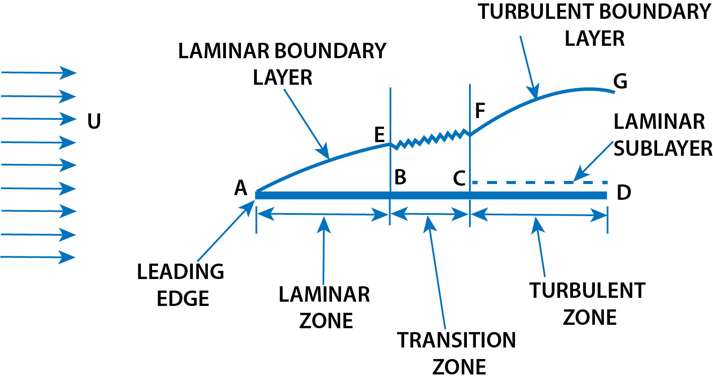
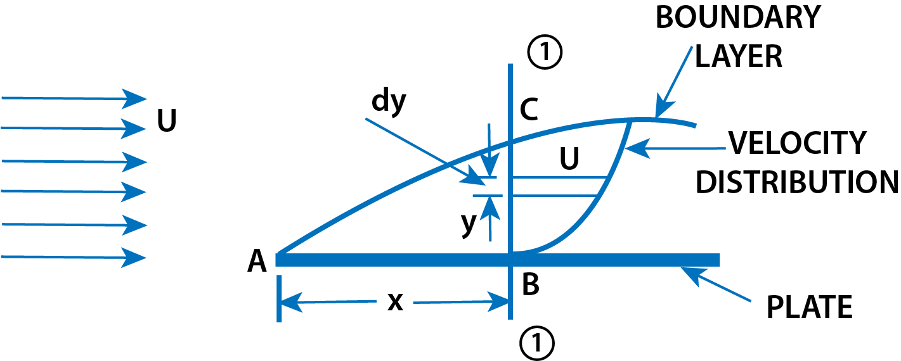

<h3>Laminar Boundary Layer</h3>

For defining the boundary layer (i.e., laminar boundary layer or turbulent boundary layer) consider the flow of a fluid, having free-stream velocity (U), over a smooth thin plate which is flat and placed parallel to the direction for free stream of fluid, as shown in Fig 1. Let us consider the flow with zero pressure gradient on one side of the plate, which is stationary.

$$ Fig\ 1.\ \ Flow\ over\ a\ plate $$

The velocity of fluid on the surface of the plate should be equal to the velocity of the plate. But plate is stationary and hence velocity of fluid on the surface of the plate is zero. But at a distance away from the plate, the fluid is having certain velocity (U). Thus a velocity gradient is set up in the fluid near the surface of the plate. This velocity gradient develops shear resistance, which retards the fluid. Thus the fluid with a uniform free stream velocity (U) is retarded in the vicinity of the solid surface of the plate and the boundary layer region begins at the sharp leading edge. At subsequent points downstream, the leading edge, the boundary layer region increases because the retarded fluid is further retarded. This is also referred as the growth of boundary layer. Near the leading edge of the surface of the plate, where the thickness is small, the flow in the boundary layer is laminar though the main flow is turbulent. This layer of the fluid is said to be laminar boundary layer. This is shown by AE in Fig 1. The length of the plate from the leading edge, upto which laminar boundary layer exists, is called laminar zone. This is also referred as the growth of boundary layer. Near the leading edge of the surface of the plate, where the thickness is small, the flow in the boundary layer is laminar though the main flow is turbulent. This layer of the fluid is said to be laminar boundary layer. This is shown by AE in Fig 1. The length of the plate from the leading edge, upto which laminar boundary layer exists, is called laminar zone. This is shown by distance AB. The distance of B from leading edge is obtained from Reynold number equal to 5 * 105 for a plate. Because, upto this Reynold number the boundary layer is laminar. The Reynold number is given by

$$ (R_e)_x = \frac{U x}{\nu} $$

where
<ul>
    <li>x = Distance from leading edge,</li>
    <li>U = Free-stream velocity of fluid,</li>
    <li>&#957; = Kinematic viscosity of fluid.</li>
</ul>

Hence for laminar boundary layer, we have

$$ 5 \times 10^5 = \frac{U x}{\nu} \ \ \ \ \ ...(1) $$

If the values of U and &#957; are known, x or the distance from the leading edge upto which laminar boundary layer exists can be calculated.

<h3>Boundary Layer Thickness (&#948;)</h3>

It is defined as the distance from the boundary of the solid body measured in the y-direction to the point, where the velocity of the fluid is approximately equal to 0.99 times the free stream velocity (U) of the fluid. It is denoted by the symbol &#948;. For laminar and turbulent zones it is denoted as:

<ol>
    <li>&#948;lam = Thickness of laminar boundary layer,</li>
    <li>&#948;tur = Thickness of turbulent boundary layer, and</li>
    <li>&#948;' = Thickness of laminar sub-layer.</li>
</ol>

<h3>Displacement Thickness (&#948;*)</h3>

It is defined as the distance, measured perpendicular to the boundary of the solid body, by which the boundary should be displaced to compensate for the reduction in flow rate on account of boundary layer formation. It is denoted by &#948;*. It is also defined as:

"The distance perpendicular to the boundary, by which the free-stream is displaced due to the formation of boundary layer."

<h4>Expression for &#948;*</h4>

$$ Fig\ 2.\ \ Displacement\ thickness $$

Consider the flow of a fluid having free-stream velocity equal to U over a thin smooth plate as shown in Fig 2. At a distance x from the leading edge consider a section 1-1. The velocity of fluid at B is zero and at C, which lies on the boundary layer, is U. Thus velocity varies from zero at B to U at C, where BC is equal to the thickness of boundary layer i.e.,

Distance BC = &#948;

At the section 1-1, consider an elemental strip.

Let

<ul>
    <li>y = distance of elemental strip from the plate,</li>
    <li>dy = thickness of the elemental strip,</li>
    <li>u = velocity of fluid at the elemental strip,</li>
    <li>b = width of plate.</li>
</ul>

Then area of elemental strip, dA = b * dy

Mass of fluid per second flowing through elemental strip = &#961; * Velocity * Area of elemental strip

= &#961;u * dA = &#961;u * b * dy

If there had been no plate, then the fluid would have been flowing with a constant velocity equal to free-stream velocity (U) at the section 1-1. Then mass of fluid flowing per second through elemental strip would have been

= &#961; * Velocity * Area = &#961; * U * b * dy

As U is more than u, hence due to the presence of the plate and consequently due to the formation of the boundary layer, there will be a reduction in mass flowing per second through the elemental strip.

This reduction in mass/sec flowing through elemental strip

= mass/sec given by equation (ii) - mass/sec given by equation (i)

= &#961;Ubdy - &#961;ubdy = &#961;b(U - u)dy

Total reduction in mass of fluid/sec flowing through BC due to plate

$$ = \int_{0}^{\delta} \rho b(U - u)dy = \rho b \int_{0}^{\delta} (U - u)dy $$

[If fluid is incompressible]

Let the plate is displaced by a distance &#948;* and velocity of flow for the distance &#948;* is equal to the free-stream velocity (i.e., U). Loss of mass of fluid/sec flowing through the distance &#948;*

= &#961; * Velocity * Area

= &#961; * U * &#948;* * b

Equating equation (iii) and (iv), we get

$$ \rho b \int_{0}^{\delta}(U-u)dy = \rho \times U \times \delta^{*} \times b $$

Cancelling &#961;b from both sides, we have

$$ \int_{0}^{\delta}(U-u)dy = U\times\delta^{*} $$

$$ \delta^{*} = \frac{1}{U}\int_{0}^{\delta}(U-u)dy = \int_{0}^{\delta}\frac{(U-u)dy}{U} $$

[U is constant and can be taken inside the integral]

$$ \delta^{*} = \int_{0}^{\delta}(1-\frac{u}{U})dy $$

<h3>Momentum Thickness (&#952;)</h3>

Momentum thickness is defined as the distance, measured perpendicular to the boundary of the solid body, by which the boundary should be displaced to compensate for the reduction in momentum of the flowing fluid on account of boundary layer formation. It is denoted by &#952;.

Consider the flow over a plate as shown in Fig 2. Consider the section 1-1 at a distance x from the leading edge. Take an elemental strip at a distance y from the plate having thickness (dy). The mass of fluid flowing per second through this elemental strip is given by equation (i) and is equal to &#961;ubdy.

Momentum of this fluid = Mass * Velocity = (&#961;ubdy)u

Momentum of this fluid in the absence of boundary layer = (&#961;ubdy)U

Loss of momentum through elemental strip = (&#961;ubdy)U - (&#961;ubdy)u = &#961;bu(U-u)dy

Total loss of momentum/sec through BC =  $$ \int_{0}^{\delta}pbu(U-u)dy \ \ \ \ \ ...(2) 

Let θ = distance by which plate is displaced when the fluid is flowing with a constant velocity U

Loss of momentum/sec of fluid flowing through distance θ with a velocity U

= Mass of fluid through &#952; * velocity

= (&#961; * area * velocity) * velocity

= [&#961; * &#952; * b * U] * U

= &#961; &#952;bU2

Equating equations (2) and (1), we have

$$ \rho \theta b U^2 = \int_{0}^{\delta}\rho bu(U-u)dy = \rho b\int_{0}^{\delta}u(U-u)dy\]

$$ \theta U^2 = \int_{0}^{\delta}u(U-u)dy $$

$$ θ = \frac{1}{U^2}\int_{0}^{\delta}u(U-u)dy = \int_{0}^{\delta}\frac{u(U-u)dy}{U^2} $$

$$ θ = \int_{0}^{\delta}\frac{u}{U}[1-\frac{u}{U}]dy $$

<h3>Energy Thickness (&#948;**)</h3>

It is defined as the distance measured perpendicular to the boundary of the solid body, by which the boundary should be displaced to compensate for the reduction in kinetic energy of the flowing fluid on account of boundary layer formation. It is denoted by &#948;**.

Consider the flow over the plate as shown in Fig 2. having section 1-1 at a distance x from the leading edge. The mass of fluid flowing per second through the elemental strip of thickness dy at a distance y from the plate as given by equation (i) = &#961;ubdy.

Kinetic energy of this fluid = 1/2 * mass * velocity2 = (&#961;ubdy)u2

Kinetic energy of this fluid in the absence of boundary layer

$$ = \frac{1}{2}(\rho ubdy)U^2 $$

Loss of K.E. through elemental strip

$$ = \frac{1}{2}(\rho ubdy)U^2 - \frac{1}{2}(\rho ubdy)u^2 = \frac{1}{2}\rho ub(U^2 - u^2)dy $$

Total loss of K.E. of fluid passing through BC

$$ = \int_{0}^{\delta}\frac{1}{2}\rho ub(U^2 - u^2)dy = \frac{1}{2}pb\int_{0}^{\delta}u(U^2 - u^2)dy $$ 

Let &#948;** = distance by which the plate is displaced to compensate for the reduction in K.E.

Loss of K.E. through δ** of fluid flowing with velocity U

$$ = \frac{1}{2}(mass) * velocity^2 = \frac{1}{2}(\rho * area * velocity) * velocity^2 $$

$$ = \frac{1}{2}(\rho * b * \delta^{**} × U) × U^2 $$

$$ = \frac{1}{2}\rho b \delta^{**} U^3 $$

Equating the two losses of K.E., we get

$$ \frac{1}{2}\rho b \rho^{**} U^3 = \frac{1}{2}\rho b \int_{0}^{\delta}u(U^2 - u^2)dy $$

$$ \delta^{**} = \frac{1}{U^3}\int_{0}^{\delta}u(U^2 - u^2)dy $$

$$ \therefore \delta^{**} = \int_{0}^{\delta}\frac{u}{U}(1 - \frac{u^2}{U^2})dy $$
